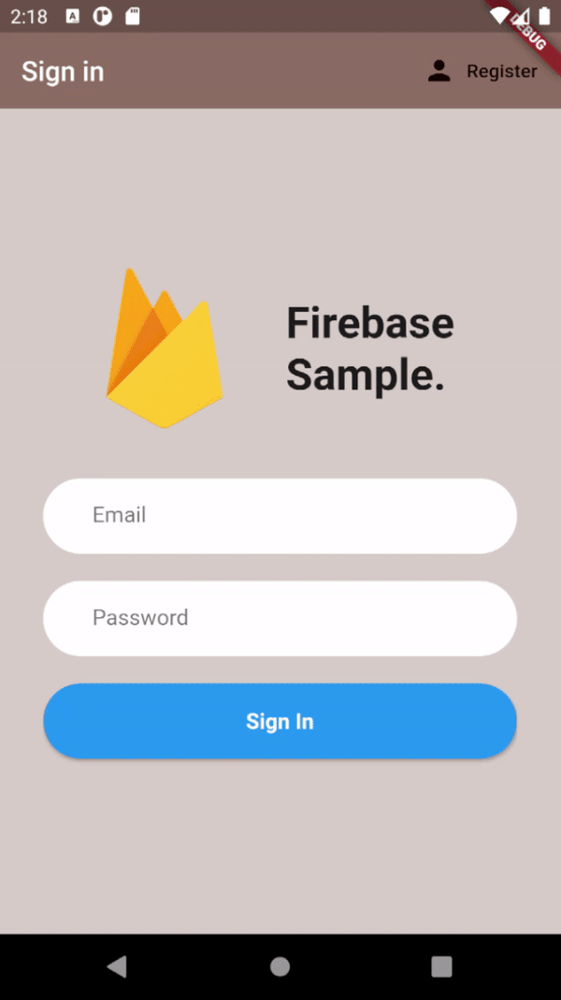

# Flutter Firebase Sample App

This app implements basic code for any future Firebase project.

## Functionalities :

- Login/Sign up system
- List of user's brew preferences
- Settings page to update preferences

## Demo

